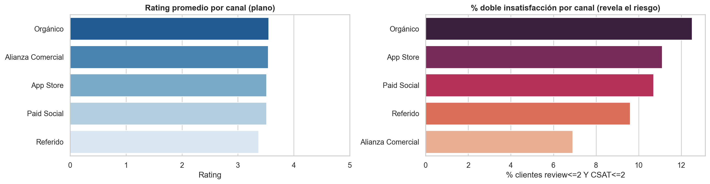
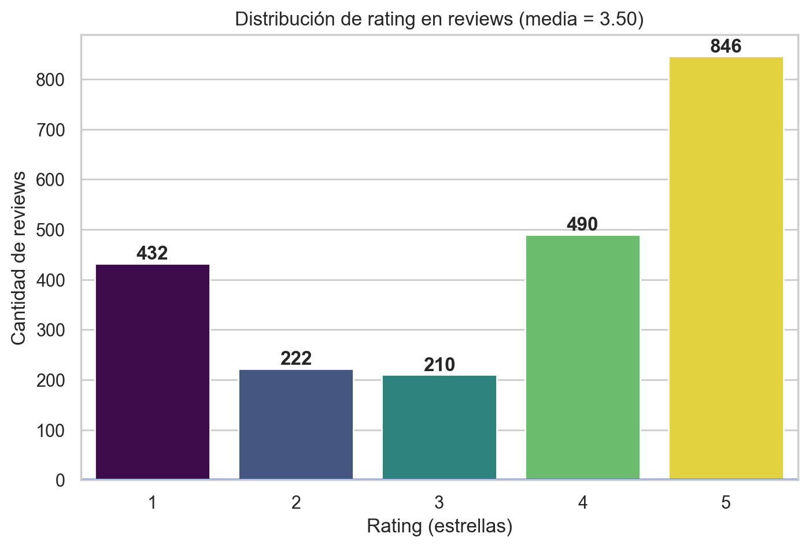
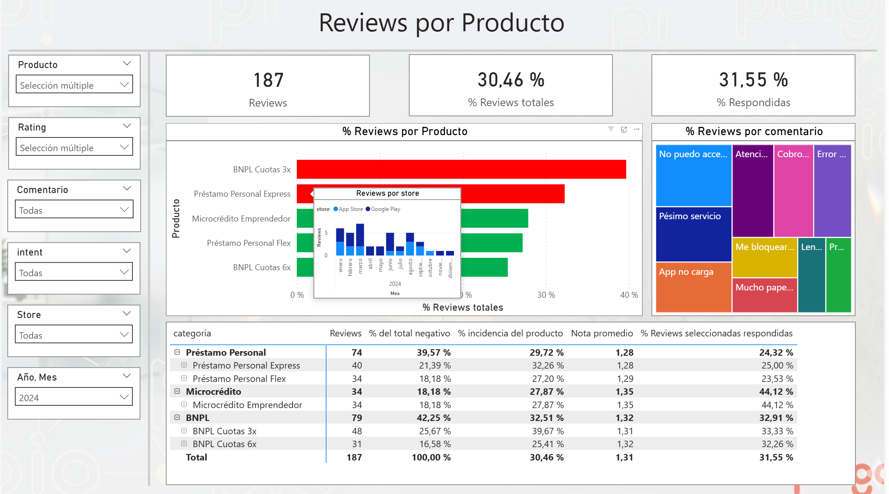
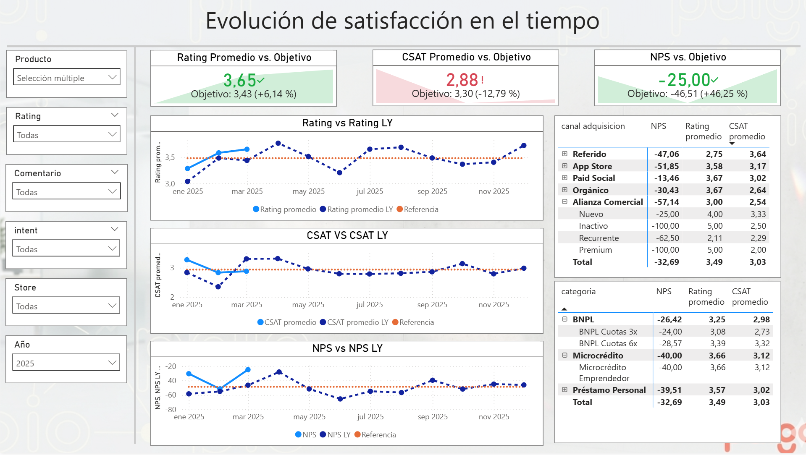
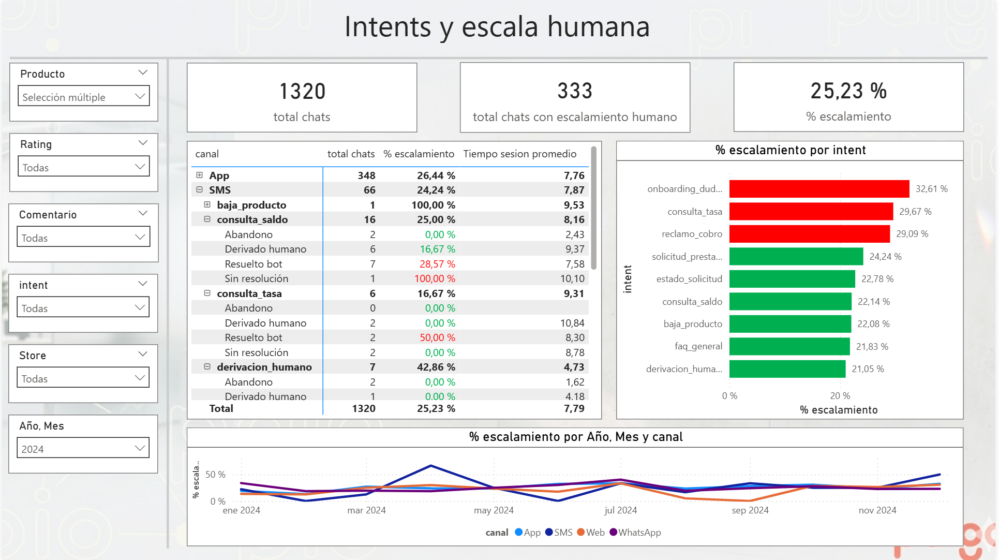

# Análisis de Customer Journey — Paigo

Análisis end-to-end del ciclo de vida del cliente de una fintech (caso **Paigo**), desde la auditoría de calidad de los datos hasta insights accionables para campañas de engagement y retención.

> Actividad práctica para el rol de **Business Intelligence / Customer Engagement Analyst**. El objetivo es transformar datos de reviews, chats del bot y clientes en decisiones de negocio concretas.

**Autor:** Franco Robotti

---

## Resumen ejecutivo

La satisfacción promedio del producto luce sana, pero esconde dos problemas accionables:

1. **El asistente conversacional (bot) arrastra la experiencia**: el CSAT (2.6–3.0 sobre 5) está muy por debajo del rating de la app (3.4–3.8) y se mantiene plano en el tiempo.
2. **Existe un segmento crítico oculto**: ~160 clientes (10.7% de la base) están *doblemente insatisfechos* (review ≤ 2 **y** CSAT ≤ 2), concentrados en los canales de mayor volumen (`Orgánico` y `Paid Social`). El promedio por canal no lo muestra; el cruce sí.

Sobre estos hallazgos se propone una **campaña de retención dirigida** y la **reingeniería de los flujos del bot** (onboarding y consulta de tasas).



*El rating promedio por canal es plano (izq.), pero el cruce de reviews y CSAT revela que la insatisfacción severa se concentra en Orgánico y Paid Social (der.).*

---

## Estructura del proyecto

```
.
├── data
│   ├── raw/            # Datos originales (Excel): clientes, productos, reviews_stores, bot_chats
│   └── clean/          # Tablas auditadas y con flags de trazabilidad (salida del notebook 01)
├── docs/               # Documentación (uso de IA, dashboards Power BI)
├── notebooks
│   ├── 00_analisis_exploratorio.ipynb   # EDA: distribuciones, cobertura temporal, granularidad
│   ├── 01_calidad_datos.ipynb           # Auditoría de calidad y dataset limpio
│   ├── 02_sql_analitico.ipynb           # Consultas de negocio (SQL sobre DataFrames con DuckDB)
│   └── 03_insights_accionables.ipynb    # Insights destilados + acciones
├── reports/figures/    # Gráficos de los notebooks + export de las 3 páginas del dashboard
├── requirements.txt
└── README.md
```

---

## Datasets

| Tabla | Filas | Descripción |
|:---|:---:|:---|
| `clientes` | 1.500 | Datos del cliente: segmento, canal de adquisición, país, NPS |
| `productos` | 5 | Catálogo de productos financieros (BNPL, préstamos, microcrédito) |
| `reviews_stores` | 2.200 | Reseñas de las app stores: rating, versión, store, comentario |
| `bot_chats` | 3.000 | Interacciones con el asistente: intent, resolución, CSAT, escalado |

---

## Metodología (flujo de trabajo)

El proyecto sigue un pipeline reproducible en cuatro etapas. Las consultas SQL se ejecutan con **DuckDB** directamente sobre DataFrames de pandas.

### `00_analisis_exploratorio`
Perfilamiento de las cuatro tablas: distribuciones univariantes, cobertura temporal (ene-2023 a mar-2025), exploración bivariante y definición de la unidad de análisis. Hallazgo central: el `rating` es **bimodal** (polarización 1★/5★), por lo que la media engaña.



### `01_calidad_datos`
Auditoría en siete dimensiones (integridad referencial, consistencia cronológica, dominios, duplicados, nulos, consistencia interna y fuente de verdad), con exportación del dataset limpio a `data/clean/` con flags de trazabilidad. Detecta los problemas que condicionan todo el análisis posterior (ver *Limitaciones*).

### `02_sql_analitico`
Cinco consultas de negocio: rating por canal, escalado por intent y canal, evolución mensual de CSAT/rating, reviews negativas por producto y doble insatisfacción por canal. Cada una cierra con sus *Hallazgos Clave* y una visualización.

### `03_insights_accionables`
Destila el análisis en cuatro insights, cada uno con su evidencia validada y su **acción** de negocio asociada, más una tabla síntesis.

---

## Hallazgos clave

| # | Hallazgo | Evidencia | Acción |
|:-:|:---|:---|:---|
| 1 | El bot arrastra la satisfacción | CSAT 2.6–3.0 < rating 3.4–3.8 | Reingeniería de flujos del bot |
| 2 | Cuello de botella del bot | `consulta_tasa` (29.8%) y `onboarding_dudas` (29.2%) son los que más escalan | Rediseñar esos flujos / autoservicio |
| 3 | Insatisfacción de producto en BNPL | `BNPL Cuotas 3x`: 37.7% de reviews negativas | Foco en BNPL + recuperar catálogo |
| 4 | El promedio por canal engaña | Doble insatisfacción: Orgánico 12.5%, Paid Social 10.7% (~160 clientes) | Campaña de retención dirigida |

---

## Dashboard interactivo (Power BI)

Los hallazgos se materializan en un dashboard de tres páginas que permite explorar los datos de forma interactiva, con filtros compartidos por **producto, rating, comentario, intent, store y período**.

### 1. Reviews por producto
Concentra la insatisfacción a nivel de producto: volumen e incidencia de reviews negativas por producto y categoría, motivos más frecuentes (treemap de comentarios) y tasa de respuesta. Da soporte al **Hallazgo 3**: `BNPL Cuotas 3x` y `Préstamo Personal Express` son los productos con mayor proporción de reviews negativas.



### 2. Intents y escala humana
Diagnostica el desempeño del bot cruzando canal, intent y tipo de resolución con la tasa de escalado a humano y el tiempo de sesión. Da soporte al **Hallazgo 2**: `onboarding_dudas`, `consulta_tasa` y `reclamo_cobro` son los intents que más escalan (≈29–33 %), señalando los flujos a rediseñar.



### 3. Evolución de satisfacción
Sigue **Rating, CSAT y NPS** mes a mes contra el mismo período del año anterior (YoY), con tarjetas ancladas al último mes con datos y tablas por canal de adquisición y categoría. Hace visible el **Hallazgo 1** (la brecha persistente entre CSAT y rating) y respalda el **Hallazgo 4** (diferencias por canal que el promedio simple oculta).




---


## Limitaciones de calidad de los datos

Un análisis honesto exige declarar qué decisiones **no** se pueden tomar con estos datos. La auditoría (`01`) detectó:

- **Catálogo incompleto:** 805 reviews (≈37%) referencian productos inexistentes (IDs 6, 7 y 8). Se conservan etiquetadas como "Desconocido".
- **Inconsistencia cronológica:** ~51% de reviews y chats tienen fecha *anterior al alta del cliente*, lo que **impide métricas de antigüedad relativa** (días desde el alta, cohortes). Se marca con flag `fecha_inconsistente`.
- **Campo `escalado_humano` incoherente** con `resolucion`: la tasa de escalado debe leerse como indicador aproximado.
- **Nulos:** CSAT 55% y NPS 8% (aparentemente aleatorios → no se imputan); `duracion_segundos` 4.7%.

---

## Cómo ejecutar

```bash
# 1. Crear entorno e instalar dependencias
pip install -r requirements.txt

# 2. Ejecutar los notebooks en orden (00 → 01 → 02 → 03)
#    El notebook 01 genera las tablas limpias en data/clean/,
#    de las que parten 02 y 03.
```

Requisitos principales: `pandas`, `duckdb`, `openpyxl`, `seaborn`, `matplotlib`, `jupyter`.

---